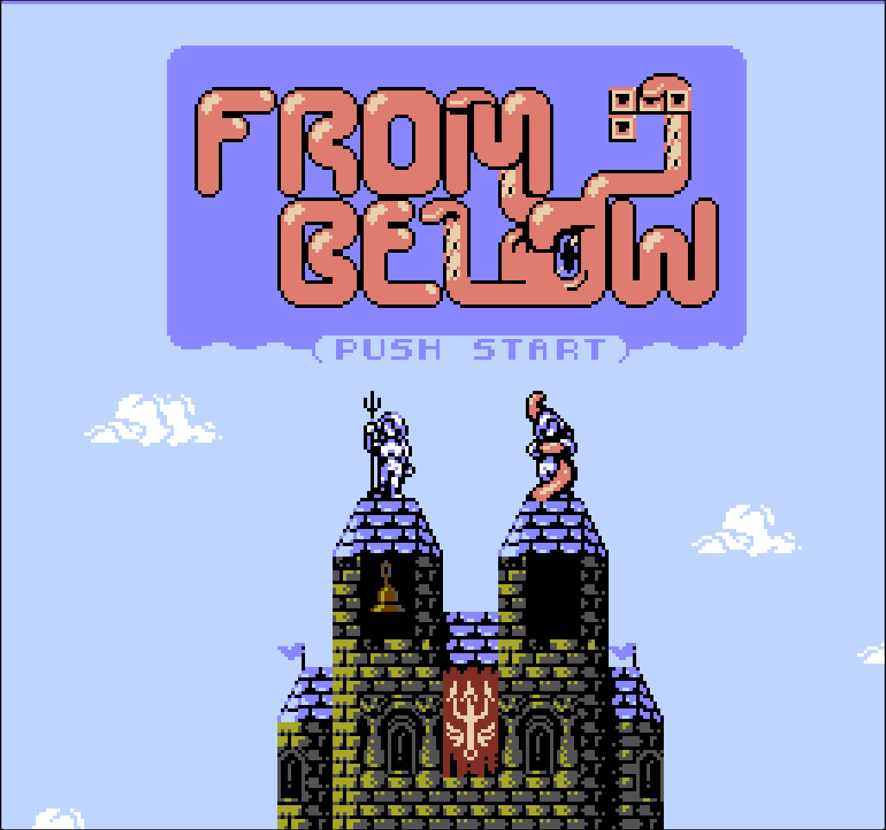
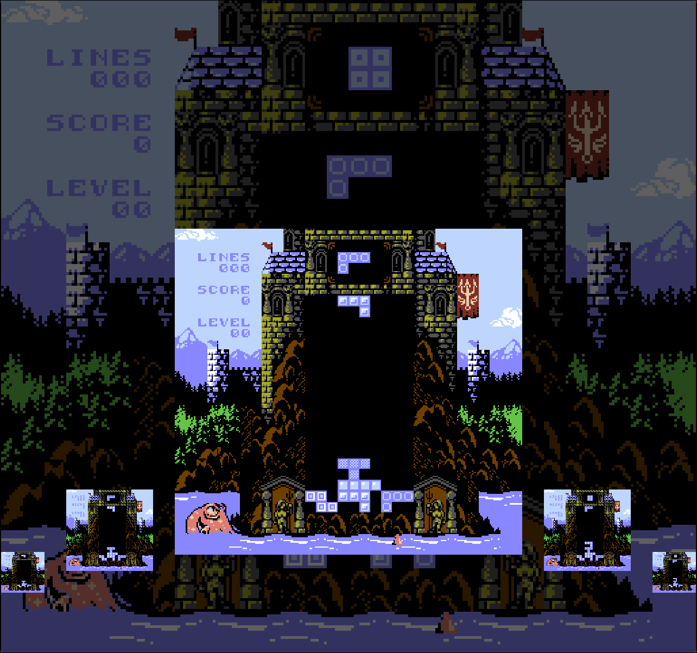
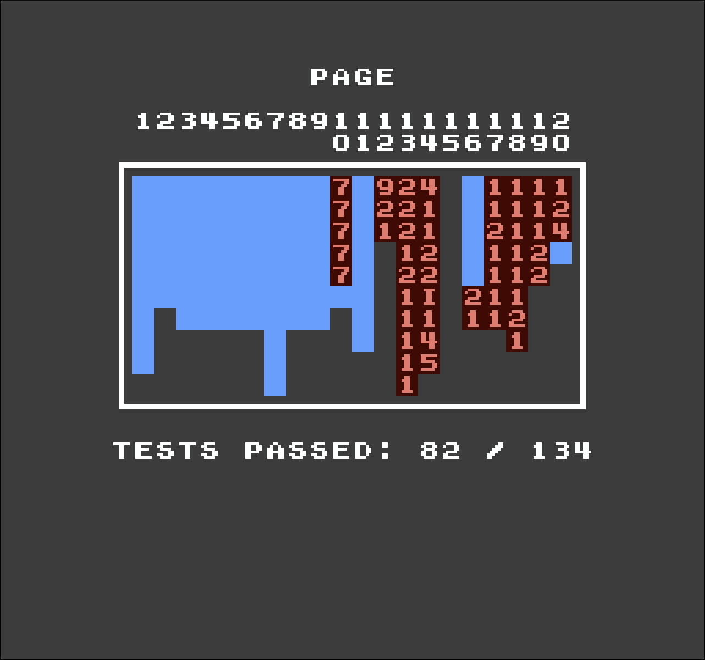

# nes_rs
nes_rs is a work-in-progress NES emulator written in Rust, created as a learning project with support for save states, rewind, audio recording, and multiple mappers.

<p align="center">
  <table>
    <tr>
      <td align="center" width="50%">
        
        <br>
        <em>nes_rs running <a href="https://mhughson.itch.io/from-below">FROM BELOW</a></em>
      </td>
      <td align="center" width="50%">
        
        <br>
        <em>nes_rs in rewind mode</em>
      </td>
    </tr>
  </table>
</p>

## About
This project was created to learn Rust and better understand how emulators work.

It is still a work in progress, and compatibility is not guaranteed.
Some games may not run correctly or may exhibit bugs.

## Platform Support
The emulator can be built and run on Linux, macOS, and Windows.

## Quick Start
```bash
cargo run --release --bin nes_rs -- ./path/to/rom.nes
```
You can download and play free ROMs such as [from-below](https://mhughson.itch.io/from-below).

## Highlights
- Rewind gameplay in real time
- Input recording and replay
- Debug views (tiles, sprites, palettes, nametables)
- Modular architecture (core + frontend)
- High CPU accuracy (based on AccuracyCoin tests)

## Build From Source

If you have SDL2 installed, you can simply build using Cargo:
```bash
cargo build --release
```
You can install SDL2 using your package manager, e.g.,
```bash
pacman -S sdl2
```

If you don't have SDL2 installed, you can compile it as part of the emulator:
```bash
cargo build --release --features bundled-sdl2
```
If you encounter an error like `Compatibility with CMake < 3.5 has been removed from CMake.` then you will have to downgrade your CMake version or install/compile SDL2 manually.
This error originates from the SDL2 crate, not from the emulator itself.

## Usage
```
nes_rs --help
A NES emulator

Usage: nes_rs [OPTIONS] <ROM_PATH>

Arguments:
  <ROM_PATH>  path to the ROM

Options:
      --export-wav                   whether to record the in game audio. The recording is written to "./<rom_name>.wav"
      --scaling <SCALING>            the scaling factor [default: 6]
      --palette-path <PALETTE_PATH>  provide a path to a custom palette
      --enable-integer-scaling       enables integer scaling
  -h, --help                         Print help
```

### Example
```bash
nes_rs ./from_below.nes --palette-path ./contrast.palette --enable-integer-scaling --scaling 2
```

You can generate a custom palette using https://bisqwit.iki.fi/utils/nespalette.php

### Keymaps
Default key bindings are shown below.

<table>
<tr>
<td valign="top">

#### System / UI (Keyboard)
| Key         | Action          |
|-------------|-----------------|
| Q           | Exit            |
| M           | Tile Map View   |
| T           | Tile View       |
| O           | Sprite View     |
| P           | Palette View    |
| F           | Toggle FPS      |
| G           | Show Grid       |
| Escape      | Pause           |
| E           | Save State      |
| R           | Load State      |
| Z           | Rewind View     |
| +           | Fast Forward    |
| -           | Slow Down       |
| Right Arrow | Rewind Right    |
| Left Arrow  | Rewind Left     |
| Space       | Rewind Load     |
| Y           | Record Input    |
| X           | Replay Input    |
| W           | Take Screenshot |

</td>
<td valign="top">

#### System / UI (Controller)
| Button         | Action        |
|----------------|---------------|
| Right Stick    | Fast Forward  |
| Left Stick     | Slow Down     |
| Left Shoulder  | Save State    |
| Right Shoulder | Load State    |
| Misc1          | Rewind View   |
| D-Pad Right    | Rewind Right  |
| D-Pad Left     | Rewind Left   |
| B              | Rewind Load   |

</td>
</tr>
<tr>
<td valign="top">

#### Controller 1 (Keyboard)
| Key         | NES Button |
|-------------|------------|
| Down Arrow  | Down       |
| Up Arrow    | Up         |
| Right Arrow | Right      |
| Left Arrow  | Left       |
| A           | A          |
| S           | B          |
| Space       | Select     |
| Enter       | Start      |

</td>
<td valign="top">

#### Controller 2 (Keyboard)
| Key | NES Button |
|-----|------------|
| J   | Down       |
| K   | Up         |
| L   | Right      |
| H   | Left       |
| U   | A          |
| I   | B          |
| B   | Select     |
| N   | Start      |

</td>
</tr>
<tr>
<td valign="top">

#### Controller 1 (Gamepad)
| Button      | NES Button |
|-------------|------------|
| D-Pad Down  | Down       |
| D-Pad Up    | Up         |
| D-Pad Right | Right      |
| D-Pad Left  | Left       |
| B           | A          |
| A           | B          |
| Start       | Select     |
| Back        | Start      |

</td>
<td valign="top">

#### Controller 2 (Gamepad)
| Button      | NES Button |
|-------------|------------|
| D-Pad Down  | Down       |
| D-Pad Up    | Up         |
| D-Pad Right | Right      |
| D-Pad Left  | Left       |
| B           | A          |
| A           | B          |
| Start       | Select     |
| Back        | Start      |

</td>
</tr>
</table>

## Accuracy
The emulator passes most CPU-related tests from AccuracyCoin, indicating high CPU accuracy (see image below for detailed results).
<p align="center">
  
  <br>
  <em>Test results of <a href="https://github.com/100thCoin/AccuracyCoin">AccuracyCoin</a></em>
</p>

## Features
### Emulation Features
- Creating and loading save states
- Rewinding time
- Audio playback and recording
- Custom palettes
- Fast-forward
- Take screenshots

### Debugging Features
- Record and replay input
- Show a tile grid overlay
- Show an FPS counter
- Show the contents of the character RAM
- Show all nametables
- Show the contents of the OAM memory
- Show the current palette

## Mappers
Supported Mappers:
- NROM (id: 0)
- MMC1 (id: 1)
- CNROM (id: 3)

## Architecture
```
nes_rs/                 ← workspace root
├── Cargo.toml
├── nes_rs_core/        ← the emulator itself
│   ├── Cargo.toml
│   └── src/...
└── nes_rs/             ← the emulator front end
    ├── Cargo.toml
    └── src/...
```
The emulator core is completely independent of the front end and any graphics crates such as sdl2.
This separation allows the core to be reused independently, making it easier to build alternative frontends (e.g., native, web, or mobile).

## TODO
- PPU: switch from scanline to pixel rendering
- Add more mappers
- Add no_std support
- Multiple save states + selection UI
- Visual indicators (pause, fast-forward, state load)
- Video recording
- Cheat support (possibly via public database)
- Android version
- Publish on crates.io
- AUR package

## Attributions
### Font
Name: omelette_font

Created By Bananattack - https://github.com/Bananattack/omelette_font

Licence: https://github.com/Bananattack/omelette_font/blob/master/asset_license.md

### Code
Since this is my first emulator the initial architecture was inspired by https://bugzmanov.github.io/nes_ebook/chapter_1.html.
However, the current version is far more complex and feature-rich, having among others a more accurate CPU and PPU, audio, more mappers, and save states.

## License
MIT
